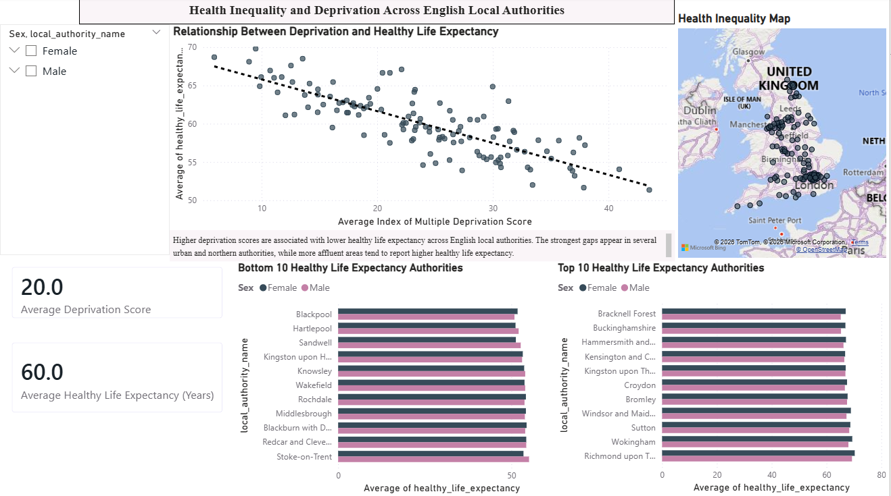
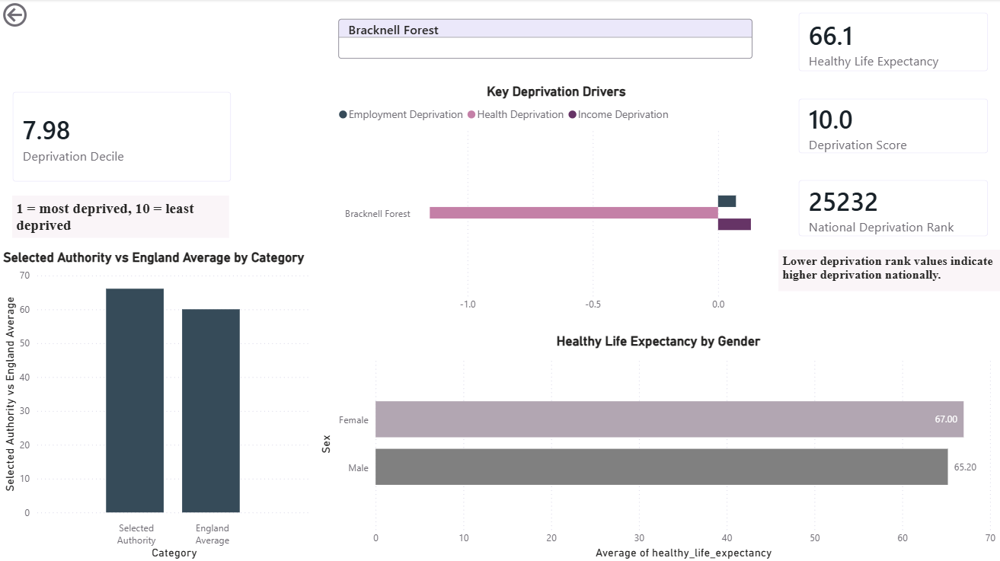
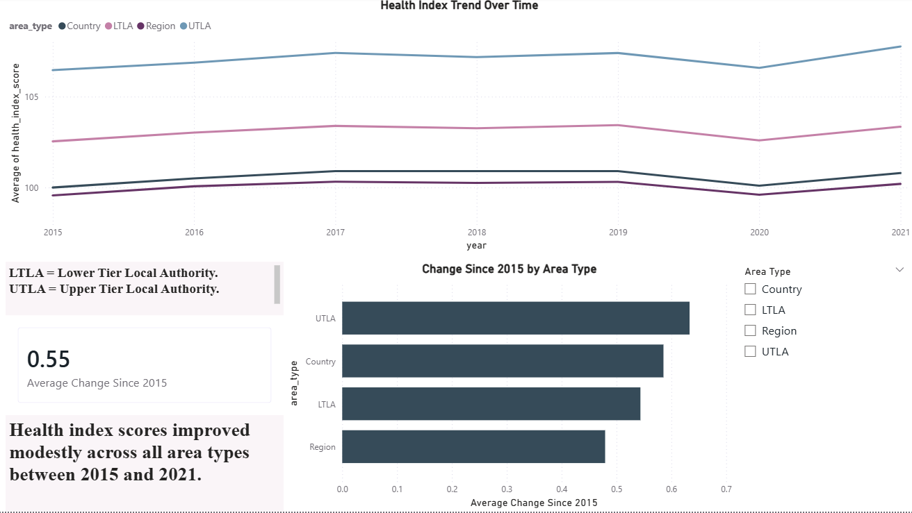
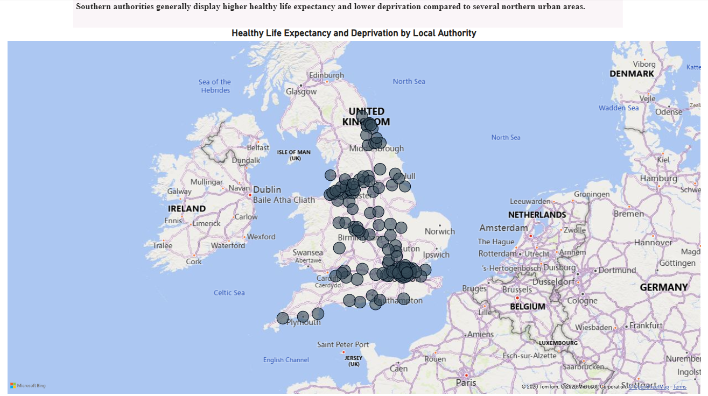
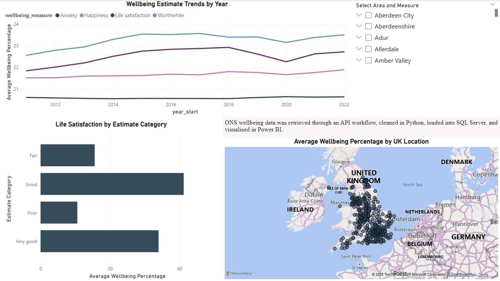

# Health Inequality Power BI + SQL Analysis

Tools: SQL Server, SQL, Power BI, CSV data processing, dashboard visualisation, geospatial analysis

This project analyses health inequality and deprivation trends across English local authorities using SQL Server and Power BI. It demonstrates an end-to-end analyst workflow from SQL querying and dataset preparation through to interactive dashboard reporting.

## Project Overview

The project explores:

- Health index trends between 2015 and 2021
- Healthy life expectancy differences across local authorities
- The relationship between deprivation and health outcomes
- Geographic variation in health inequality
- Regional and area-type comparisons

## Project Workflow

1. Imported health inequality and deprivation datasets into SQL Server.
2. Created warehouse-style tables for structured analysis.
3. Wrote SQL queries using joins, aggregations, filtering, and trend analysis.
4. Exported a cleaned analytical dataset for reporting.
5. Built a Power BI dashboard with charts, maps, filters, and KPI cards.

## Key Insights

- Higher deprivation scores were associated with lower healthy life expectancy.
- Several northern urban authorities showed lower healthy life expectancy compared with less deprived southern authorities.
- Health index scores improved modestly across most area types between 2015 and 2021.
- Geographic mapping showed visible clustering of lower health outcomes in more deprived areas.

## Visualisations

### Dashboard Overview


### Deprivation Dashboard


### Health Index Trend


### Geographic Health Map


### Local Authority Health Map


## Repository Structure

```text
Health-Inequality-PowerBI-SQL/
│
├── Health_Inequality_Dashboard.pbix
├── health_inequality_queries.sql
├── health_inequality_final.csv
├── dashboard_overview.png
├── deprivation_dashboard.png
├── health_index_trend.png
├── geographic_health_map.png
├── local_authority_health_map.png
└── README.md
```
## Author

### Sarunas Surdokas
